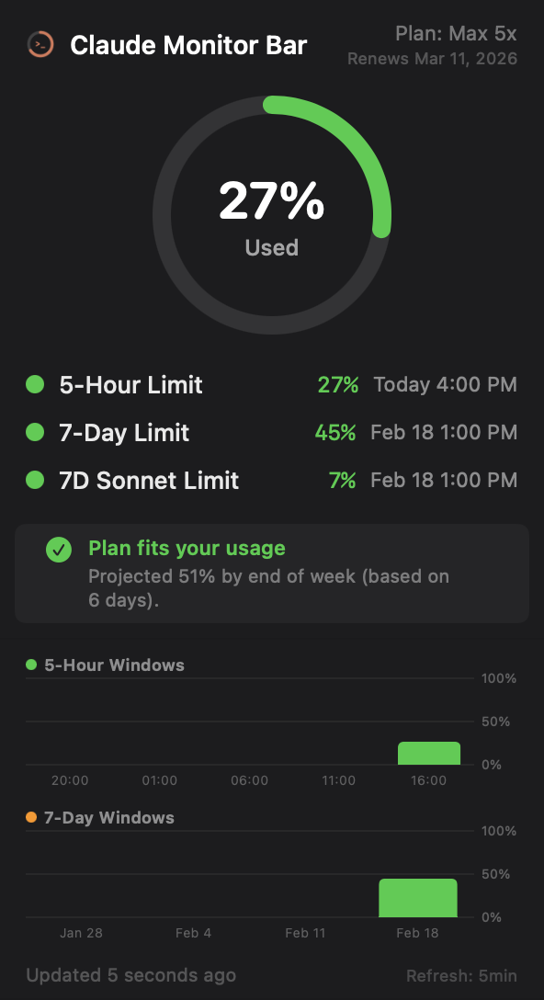
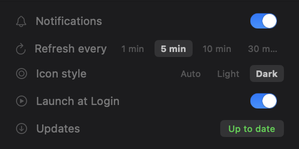

# Claude Monitor Bar

A native macOS menu bar app that displays your Claude Code API usage limits in real time.

  

<p align="center">
  
  &nbsp;&nbsp;&nbsp;
  
</p>

## Features

- **Real-time usage monitoring** — 5-hour, 7-day, and 7-day Sonnet rate limits from Anthropic's API
- **Circular progress ring** with color-coded menu bar icon (green/yellow/red)
- **Reset times** for each limit window
- **Plan recommendation** — suggests upgrade, downgrade, or stay based on 7-day usage projection
- **Usage history charts** — 5-hour and 7-day window bar charts with persistent history
- **Adaptive refresh** — automatically adjusts polling interval when usage is stable
- **Auto-update** — checks GitHub for new releases and self-installs updates
- **Notifications** — alerts at 80%, 90%, and 100% usage thresholds
- **Launch at Login** — optional auto-start via LaunchAgent
- **Subscription info** — shows your plan tier and renewal date

## How It Works

The app reads your Claude Code OAuth token from the macOS Keychain and makes a minimal API call (`max_tokens=1`) to Anthropic's Messages API. The response headers contain real-time rate limit data:

- `anthropic-ratelimit-unified-5h-utilization`
- `anthropic-ratelimit-unified-7d-utilization`
- `anthropic-ratelimit-unified-7d_sonnet-utilization`

Your profile and subscription info are fetched from the OAuth profile endpoint.

## Requirements

- macOS 14.0 (Sonoma) or later
- [Claude Code](https://docs.anthropic.com/en/docs/claude-code) installed and authenticated (the app reads its OAuth token from Keychain)

## Install

### From GitHub Release

1. Download `ClaudeMonitorBar.zip` from the [latest release](https://github.com/paradoxlabdev/claudemonitorbar/releases/latest)
2. Unzip and move `ClaudeMonitorBar.app` to `/Applications/`
3. On first launch macOS will block the app — go to **System Settings → Privacy & Security** and click **"Open Anyway"**

### Build from Source

```bash
git clone https://github.com/paradoxlabdev/claudemonitorbar.git
cd claudemonitorbar

# Build .app bundle
./build-app.sh

# Move to Applications (optional)
mv ClaudeMonitorBar.app /Applications/
```

## Development

```bash
# Build
swift build

# Run from terminal
.build/arm64-apple-macosx/debug/ClaudeMonitorBar

# Run tests
swift test
```

## Project Structure

```
Sources/ClaudeMonitorBar/
  ClaudeMonitorBarApp.swift           # App entry point (MenuBarExtra + icon rendering)
  Models/
    UsageLimit.swift                  # Rate limit data model
    PlanRecommendation.swift          # Upgrade/downgrade logic (linear projection)
    PlanTier.swift                    # Plan tier definitions
    UsageHistory.swift                # Persistent usage snapshots
  Services/
    RateLimitFetcher.swift            # API calls (usage data + profile)
    SessionManager.swift              # Observable state + adaptive refresh
    AppPreferences.swift              # Settings (UserDefaults + LaunchAgent)
    NotificationManager.swift         # Usage threshold alerts
    UpdateChecker.swift               # GitHub release auto-updater
  Views/
    MenuBarView.swift                 # Main popup UI + settings panel
    CircularProgressView.swift        # Progress ring
    LimitRowView.swift                # Individual limit row
    UsageChartView.swift              # 5-hour and 7-day history charts
```

## Security

- OAuth token is read from the macOS Keychain (never stored or exported by this app)
- Only connects to `api.anthropic.com` and `api.github.com` (update checks)
- Each refresh consumes 1 API token (minimal call to retrieve rate limit headers)
- Usage history stored locally in `~/Library/Application Support/ClaudeMonitorBar/`
- Ad-hoc code signed for local use

## License

MIT - see [LICENSE](LICENSE) for details.

---

Made by [ParadoxLab.dev](https://paradoxlab.dev/)
